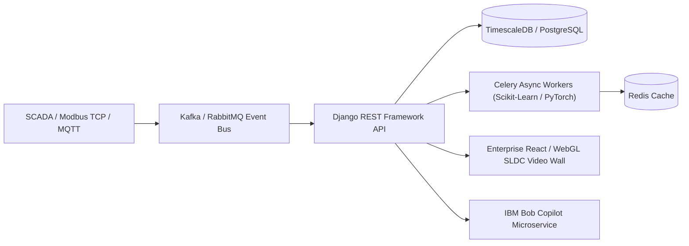

# 🏗️ G-EnergySense AI: Technical Architecture & System Design

**Gujarat State & District Energy Intelligence & Predictive Load Optimization Copilot**  
*IBM Bob AI Innovation Hackathon 2026*

---

## 1. High-Level Architecture Overview

G-EnergySense AI is structured as a multi-tier operational intelligence platform designed for the **Gujarat State Load Despatch Centre (SLDC, Gotri, Vadodara)** and **GETCO**:

```mermaid
flowchart TD
    subgraph SENSORS["1. GETCO Grid Telemetry & Feeder Layer"]
        S1["66kV Substation Feeder RTUs"]
        S2["400kV/220kV Inter-DISCOM Links"]
        S3["Khavda & Charanka Solar Inverters"]
        S4["Pandesara & Dahej Heavy Industrial SCADA"]
    end

    subgraph INGESTION["2. Data Ingestion & Normalization"]
        I1["Telemetry Stream Processor"]
        I2["Feature Normalizer & Imputer"]
        I3["Rolling Window Generator (15-min cadence)"]
    end

    subgraph ANALYTICS["3. Machine Learning Core"]
        M1["Isolation Forest Anomaly Engine<br/>(Surge, Sag & Harmonics Root-Cause)"]
        M2["Random Forest & GBM Forecaster<br/>(Multi-Hour Peak Demand)"]
        M3["Duck Curve & Ramp-Down Analyzer<br/>(Solar Transition Rate)"]
        M4["CERC DSM Penalty Risk Engine<br/>(Real-Time Financial Exposure)"]
    end

    subgraph SERVICES["4. Dispatch & Integration Services"]
        D1["SLDC Directives Dispatch Engine"]
        D2["REST API Gateway (/api/v1/...)"]
        D3["IBM Bob Autonomous Copilot (Tools)"]
    end

    subgraph PRESENTATION["5. Command Center UI"]
        UI1["Geospatial Gujarat Map (Plotly)"]
        UI2["District Ranking Leaderboard"]
        UI3["Power Quality & IEEE 519 THD Analytics"]
        UI4["Operator Incident Briefing Console"]
    end

    SENSORS --> INGESTION
    INGESTION --> ANALYTICS
    ANALYTICS --> SERVICES
    SERVICES --> PRESENTATION
```

---

## 2. Machine Learning & Analytical Formulations

### A. Isolation Forest Anomaly Detection & Physical Attribution
The anomaly engine isolates localized feeder spikes and voltage sags without requiring pre-labeled training data.
- **Tree-based Isolation:** Given a dataset of n instances, the anomaly score s for instance x is defined as:
  s(x, n) = 2^(-E(h(x)) / c(n))
  where h(x) is the path length of observation x, E(h(x)) is the expected path length over a collection of isolation trees, and c(n) is the average path length of unsuccessful searches in a Binary Search Tree:
  c(n) = 2 * (ln(n - 1) + 0.5772156649) - (2(n - 1) / n)

- **Physical Root-Cause Attribution:**
  When s(x, n) > threshold, the system evaluates physical parameters:
  Delta_load = ((P_actual - P_expected) / P_expected) * 100%
  - If Delta_load >= 25% -> **Active Power Surge**
  - If THD >= 5.5% -> **Harmonic Distortion (IEEE 519 breach)**
  - If PF < 0.95 -> **Inductive Reactive Drain**
  - If f_grid < 49.92 Hz -> **System Frequency Sag**

### B. Multi-Model Load Forecaster
The predictive engine combines Random Forest Regression (M1) and Gradient Boosting (M2) with lag-based feature embeddings:
- **Feature Vector:**
  x_t = [hour(t), day(t), P(t-1h), P(t-2h), P_rolling_4h(t)]
- **Ensemble Output:**
  P_pred = w1 * M1(x) + w2 * M2(x)
- **State Peak Alert:** Triggered when P_pred >= 21,500 MW.

### C. Power Quality & Total Harmonic Distortion (THD)
To ensure compliance with **IEEE Standard 519**, voltage and current harmonic distortion is calculated as:
THD = sqrt(sum_{n=2}^inf V_n^2) / V_1 * 100%
Any bus exceeding 5.0% THD triggers immediate dispatch directives to switch capacitor banks and verify harmonic active filter status.

### D. CERC Deviation Settlement Mechanism (DSM) Penalty
Gujarat DISCOMs face regulatory penalties from the Central Electricity Regulatory Commission (CERC) for overdrawing during under-frequency conditions:
Penalty = max(0, P_actual - P_schedule) * R(f_grid)
where the reference tariff R(f_grid) escalates exponentially when frequency drops below 49.90 Hz (up to Rs. 12.50 / kWh).

---

## 3. Territorial Coverage: Gujarat 10 Hubs & 4 DISCOMs

| District / Hub | DISCOM Zone | Coordinates | Dominant Load Character |
| :--- | :--- | :--- | :--- |
| **Ahmedabad Metro** | UGVCL | 23.02 N, 72.57 E | Commercial HVAC, Metro Rail, Urban Residential |
| **Surat Industrial Corridor** | DGVCL | 21.17 N, 72.83 E | Textile Weaving, Diamond Polishing, Continuous Process |
| **Vadodara Engineering Hub** | MGVCL | 22.31 N, 73.18 E | Heavy Electrical, Pharmaceuticals, Petrochemicals |
| **Rajkot Auto & Foundry** | PGVCL | 22.30 N, 70.80 E | Induction Melting Furnaces, Auto Ancillaries |
| **Anand & Kheda (CHARUSAT Zone)** | MGVCL | 22.56 N, 72.93 E | Amul Dairy Processing, Agro-Cold Stores, University Campus |
| **Gandhinagar & GIFT City** | UGVCL | 23.22 N, 72.64 E | High-Density Fintech Data Centers, Smart City Infrastructure |
| **Kutch & Mundra Port Hub** | PGVCL | 23.24 N, 69.67 E | Heavy Port Cranes, Khavda Mega Solar/Wind Feeder Hub |
| **Bharuch & Ankleshwar PCPIR** | DGVCL | 21.71 N, 73.00 E | Petrochemical Refining, Chemical Continuous Reactions |
| **Jamnagar Refining Hub** | PGVCL | 22.47 N, 70.06 E | Petroleum Refining, Desalination, Brass Foundries |
| **Bhavnagar Ship & Marine Hub** | PGVCL | 21.76 N, 72.15 E | Alang Shipbreaking, Induction Arc Rolling Mills |

---

## 4. Production Roadmap: Django Enterprise Backend

While the hackathon demonstration is powered by a high-performance, zero-latency **Python + Streamlit** reactive engine, our production deployment blueprint features:

- **Database:** TimescaleDB (PostgreSQL extension for hypertable time-series storage).
- **Asynchronous Workers:** Celery + Redis for continuous 15-minute background retraining.
- **REST Endpoints:** Already prototyped in `src/api.py` (`/api/v1/grid/live`, `/api/v1/anomalies/active`, `/api/v1/forecast/upcoming`).
